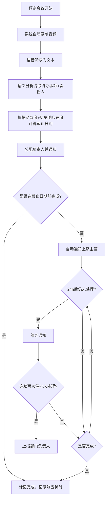
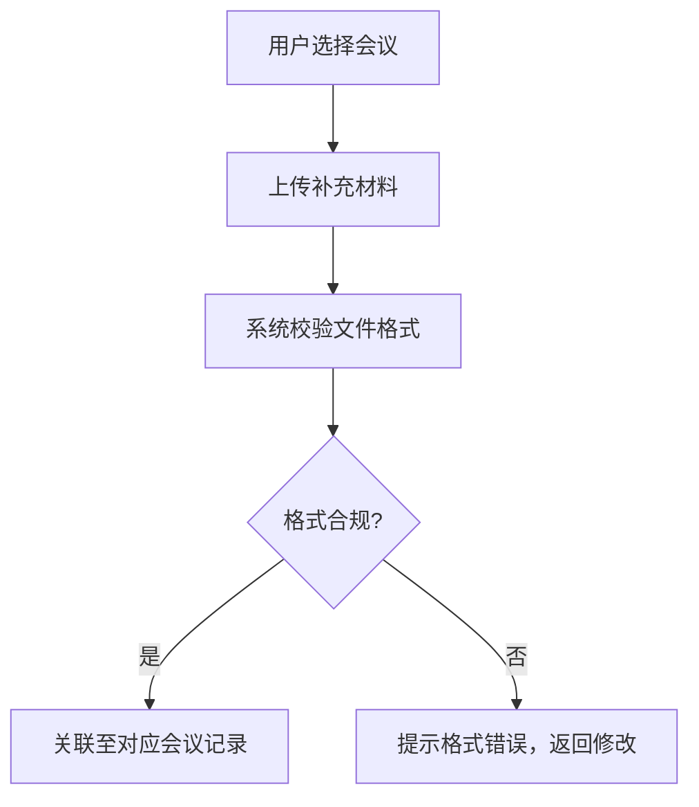
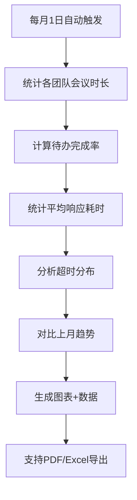

## 1. 产品概述

智能会议管理平台——面向企业团队的会议全生命周期管理系统，通过自动录制转写、语义提取待办、智能截止日期计算、超时升级催办、月度效率分析等核心能力，实现从"开会"到"落地"的闭环追踪，显著提升会议ROI和团队执行力。

## 2. 核心功能

### 2.1 用户角色

| 角色 | 注册方式 | 核心权限 |
|------|----------|----------|
| 系统管理员 | 后台分配 | 全部权限、系统配置、用户管理 |
| 部门负责人 | 后台分配 | 查看本部门会议/待办、审批升级报告、查看效率报告 |
| 团队主管 | 后台分配 | 管理团队待办、接收催办通知、查看团队报告 |
| 普通成员 | 邮箱注册 | 查看自己相关会议、处理分配的待办、上传材料 |

### 2.2 功能模块

1. **工作台首页**：关键指标看板、近期会议列表、超期待办提醒、快速操作入口
2. **会议管理**：会议列表、录制状态、转写进度、会议详情（纪要+待办+材料）
3. **待办中心**：全部待办看板、按状态/紧急度/责任人筛选、截止日期智能计算、超时升级流程
4. **效率报告**：月度效率分析、团队会议时长、待办完成率、响应耗时、超时分布、环比趋势、PDF/Excel导出
5. **历史查询**：按主题/日期/责任人组合搜索、批量导出
6. **操作日志**：全量操作记录、异常事件追踪、实时异常推送

### 2.3 页面详情

| 页面名称 | 模块名称 | 功能描述 |
|----------|----------|----------|
| 工作台首页 | 指标看板 | 展示本周会议数、待办总数、完成率、超时率等核心指标 |
| 工作台首页 | 近期会议 | 展示最近7天已开/预定会议卡片，显示主题、时间、待办数 |
| 工作台首页 | 超时预警 | 列出当前超时未完成的待办，按紧急度排序，支持一键催办 |
| 工作台首页 | 快速操作 | 新建会议、上传材料、查看报告的快捷入口 |
| 会议管理 | 会议列表 | 分页展示所有会议，支持按状态（录制中/转写中/已完成）筛选 |
| 会议管理 | 会议详情-纪要 | 展示转写文本、语义提取的待办列表、责任人分配 |
| 会议管理 | 会议详情-材料 | 上传/查看补充材料（PPT、扫描件等），系统自动校验格式并关联 |
| 待办中心 | 待办看板 | 看板视图（待处理/进行中/已完成/已超时），支持拖拽状态更新 |
| 待办中心 | 待办详情 | 待办内容、责任人、截止日期（含计算逻辑说明）、催办记录、升级记录 |
| 待办中心 | 截止日期引擎 | 根据紧急度标签+历史响应速度动态计算合理截止日期 |
| 待办中心 | 超时升级 | 超时自动通知上级主管→每24h催办→连续两次未处理上报部门负责人 |
| 效率报告 | 月度概览 | 本月会议总时长、待办完成率、平均响应耗时、超时分布 |
| 效率报告 | 团队对比 | 各团队指标对比表格和图表，环比上月趋势箭头 |
| 效率报告 | 导出中心 | 支持导出带图表的PDF和Excel |
| 历史查询 | 组合搜索 | 按会议主题关键词、日期范围、责任人组合查询 |
| 历史查询 | 搜索结果 | 匹配的会议纪要和待办明细列表，支持批量勾选导出 |
| 操作日志 | 日志列表 | 按时间倒序展示所有录制、任务分配、催办操作记录 |
| 操作日志 | 异常推送 | 关键任务持续超期等异常事件，实时推送至企业群（展示推送状态） |

## 3. 核心流程

### 3.1 会议录制→待办生成→追踪闭环

### 3.2 材料上传关联流程

### 3.3 月度报告生成流程

## 4. 用户界面设计

### 4.1 设计风格

- **主色调**：深蓝灰（#1B2A4A）为基底，搭配活力橙（#FF6B35）作为强调色，体现专业与效率感
- **辅助色**：翡翠绿（#10B981）表示完成/正常，琥珀黄（#F59E0B）表示警告/即将超时，珊瑚红（#EF4444）表示超时/紧急
- **按钮风格**：圆角微凸3D质感，主操作用橙色填充，次操作用描边样式
- **字体**：标题使用 Noto Serif SC 衬线体，正文使用 Noto Sans SC 无衬线体，数据指标使用 JetBrains Mono 等宽字体
- **布局风格**：左侧固定导航栏 + 顶部信息栏 + 内容区卡片式布局
- **图标风格**：Lucide 线性图标，2px线宽，与整体简约专业风格统一
- **视觉特效**：卡片悬浮微阴影变化、数据加载骨架屏、状态变化过渡动画

### 4.2 页面设计概览

| 页面名称 | 模块名称 | UI元素 |
|----------|----------|--------|
| 工作台首页 | 指标看板 | 4个统计卡片横排，JetBrains Mono数字，微渐变背景 |
| 工作台首页 | 近期会议 | 横向滚动卡片，每卡显示主题+时间+待办徽章 |
| 工作台首页 | 超时预警 | 红色/黄色边框卡片列表，紧急度进度条 |
| 会议管理 | 会议列表 | 表格布局，状态列用彩色圆点标识，筛选栏置顶 |
| 会议管理 | 会议详情 | 三栏Tab（纪要/待办/材料），纪要区高亮待办关键词 |
| 待办中心 | 待办看板 | 四列看板，卡片可拖拽，顶部紧急度色条 |
| 待办中心 | 待办详情 | 右侧抽屉面板，截止日期倒计时，催办时间线 |
| 效率报告 | 月度概览 | 顶部大数字指标+趋势箭头，中部图表区 |
| 效率报告 | 团队对比 | 分组柱状图+环比表格，红绿色趋势标识 |
| 历史查询 | 组合搜索 | 三行筛选条件，结果分页表格，批量勾选复选框 |
| 操作日志 | 日志列表 | 时间线样式，操作类型彩色标签，异常条目红色高亮 |

### 4.3 响应式设计

- 桌面优先设计，最低支持1280px宽度
- 平板端（768-1280px）导航栏折叠为汉堡菜单，看板视图变为列表
- 移动端（<768px）单列布局，卡片全宽，表格改为卡片列表

### 4.4 3D场景指导

不适用
