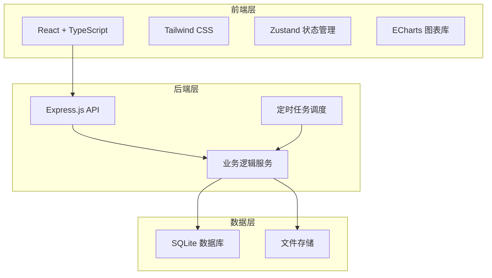
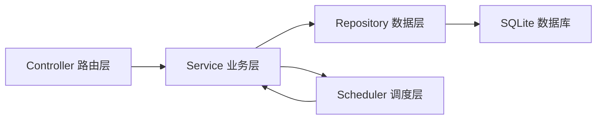
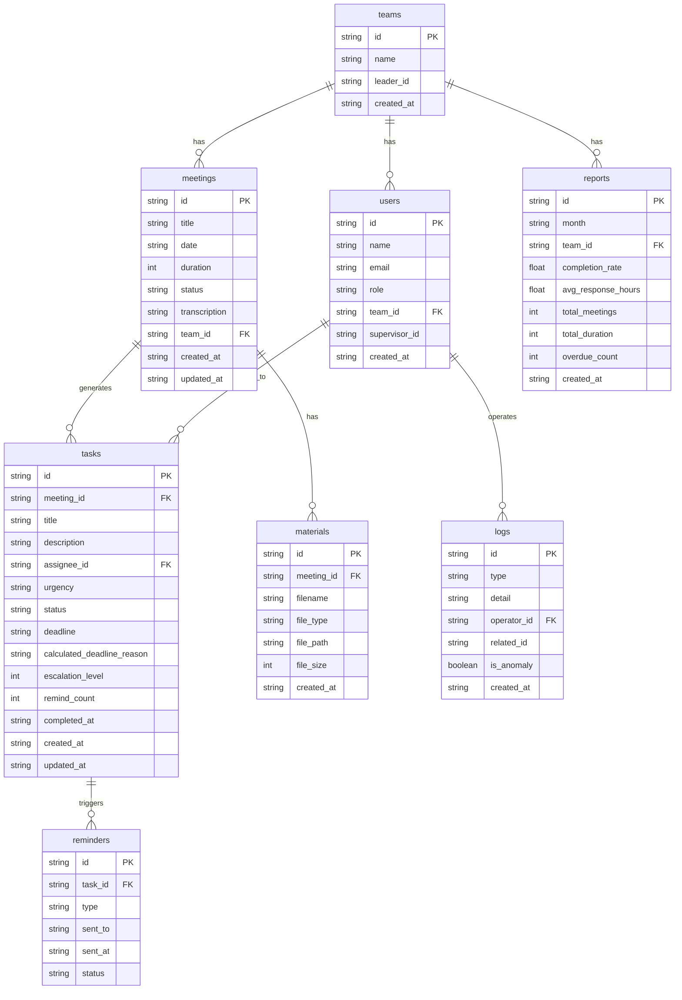

## 1. 架构设计



## 2. 技术说明

- **前端**：React@18 + TailwindCSS@3 + Vite + Zustand + ECharts
- **初始化工具**：vite-init
- **后端**：Express@4 + TypeScript (ESM)
- **数据库**：SQLite（通过 better-sqlite3）
- **图表**：ECharts（用于效率报告可视化）
- **文件处理**：multer（文件上传）、pdfkit（PDF导出）、exceljs（Excel导出）
- **定时任务**：node-cron（催办调度、月度报告生成）

## 3. 路由定义

| 路由 | 用途 |
|------|------|
| `/` | 工作台首页 - 指标看板、近期会议、超时预警 |
| `/meetings` | 会议管理 - 会议列表 |
| `/meetings/:id` | 会议详情 - 纪要/待办/材料 |
| `/tasks` | 待办中心 - 待办看板 |
| `/tasks/:id` | 待办详情 |
| `/reports` | 效率报告 - 月度分析和导出 |
| `/search` | 历史查询 - 组合搜索和批量导出 |
| `/logs` | 操作日志 - 日志列表和异常推送 |

## 4. API 定义

### 4.1 会议相关

```typescript
interface Meeting {
  id: string;
  title: string;
  date: string;
  duration: number;
  status: "recording" | "transcribing" | "completed";
  transcription: string;
  teamId: string;
  createdAt: string;
  updatedAt: string;
}

GET    /api/meetings          // 获取会议列表（支持分页、状态筛选）
GET    /api/meetings/:id      // 获取会议详情
POST   /api/meetings          // 创建会议
PUT    /api/meetings/:id      // 更新会议
DELETE /api/meetings/:id      // 删除会议

POST   /api/meetings/:id/materials  // 上传会议材料
GET    /api/meetings/:id/materials   // 获取会议材料列表
```

### 4.2 待办相关

```typescript
interface Task {
  id: string;
  meetingId: string;
  title: string;
  description: string;
  assigneeId: string;
  assigneeName: string;
  urgency: "low" | "medium" | "high" | "critical";
  status: "pending" | "in_progress" | "completed" | "overdue";
  deadline: string;
  calculatedDeadlineReason: string;
  escalationLevel: number;
  remindCount: number;
  completedAt?: string;
  createdAt: string;
  updatedAt: string;
}

GET    /api/tasks             // 获取待办列表（支持状态、紧急度、责任人筛选）
GET    /api/tasks/:id         // 获取待办详情
PUT    /api/tasks/:id         // 更新待办（状态、责任人等）
POST   /api/tasks/:id/remind  // 手动催办
GET    /api/tasks/overdue     // 获取超期待办
```

### 4.3 报告相关

```typescript
interface MonthlyReport {
  month: string;
  teams: TeamReport[];
  overallCompletionRate: number;
  overallAvgResponseTime: number;
  overdueDistribution: OverdueBucket[];
  vsLastMonth: ComparisonData;
}

GET    /api/reports/monthly          // 获取月度报告
GET    /api/reports/monthly/pdf      // 导出PDF
GET    /api/reports/monthly/excel    // 导出Excel
```

### 4.4 搜索相关

```typescript
interface SearchParams {
  keyword?: string;
  dateFrom?: string;
  dateTo?: string;
  assigneeId?: string;
  page?: number;
  pageSize?: number;
}

GET    /api/search                  // 组合搜索会议纪要和待办
POST   /api/search/export           // 批量导出搜索结果
```

### 4.5 日志相关

```typescript
interface LogEntry {
  id: string;
  type: "recording" | "task_assign" | "remind" | "escalation" | "material_upload" | "anomaly";
  detail: string;
  operatorId: string;
  operatorName: string;
  relatedId?: string;
  isAnomaly: boolean;
  createdAt: string;
}

GET    /api/logs                    // 获取日志列表（支持类型筛选、分页）
```

### 4.6 统计相关

```typescript
GET    /api/stats/dashboard         // 获取首页看板数据
```

## 5. 服务器架构图



## 6. 数据模型

### 6.1 数据模型定义



### 6.2 数据定义语言

```sql
CREATE TABLE teams (
  id TEXT PRIMARY KEY,
  name TEXT NOT NULL,
  leader_id TEXT,
  created_at TEXT NOT NULL DEFAULT (datetime('now'))
);

CREATE TABLE users (
  id TEXT PRIMARY KEY,
  name TEXT NOT NULL,
  email TEXT NOT NULL UNIQUE,
  role TEXT NOT NULL DEFAULT 'member',
  team_id TEXT,
  supervisor_id TEXT,
  created_at TEXT NOT NULL DEFAULT (datetime('now')),
  FOREIGN KEY (team_id) REFERENCES teams(id)
);

CREATE TABLE meetings (
  id TEXT PRIMARY KEY,
  title TEXT NOT NULL,
  date TEXT NOT NULL,
  duration INTEGER DEFAULT 0,
  status TEXT NOT NULL DEFAULT 'recording',
  transcription TEXT DEFAULT '',
  team_id TEXT,
  created_at TEXT NOT NULL DEFAULT (datetime('now')),
  updated_at TEXT NOT NULL DEFAULT (datetime('now')),
  FOREIGN KEY (team_id) REFERENCES teams(id)
);

CREATE TABLE tasks (
  id TEXT PRIMARY KEY,
  meeting_id TEXT NOT NULL,
  title TEXT NOT NULL,
  description TEXT DEFAULT '',
  assignee_id TEXT NOT NULL,
  urgency TEXT NOT NULL DEFAULT 'medium',
  status TEXT NOT NULL DEFAULT 'pending',
  deadline TEXT NOT NULL,
  calculated_deadline_reason TEXT DEFAULT '',
  escalation_level INTEGER DEFAULT 0,
  remind_count INTEGER DEFAULT 0,
  completed_at TEXT,
  created_at TEXT NOT NULL DEFAULT (datetime('now')),
  updated_at TEXT NOT NULL DEFAULT (datetime('now')),
  FOREIGN KEY (meeting_id) REFERENCES meetings(id),
  FOREIGN KEY (assignee_id) REFERENCES users(id)
);

CREATE TABLE materials (
  id TEXT PRIMARY KEY,
  meeting_id TEXT NOT NULL,
  filename TEXT NOT NULL,
  file_type TEXT NOT NULL,
  file_path TEXT NOT NULL,
  file_size INTEGER DEFAULT 0,
  created_at TEXT NOT NULL DEFAULT (datetime('now')),
  FOREIGN KEY (meeting_id) REFERENCES meetings(id)
);

CREATE TABLE logs (
  id TEXT PRIMARY KEY,
  type TEXT NOT NULL,
  detail TEXT NOT NULL,
  operator_id TEXT,
  related_id TEXT,
  is_anomaly INTEGER DEFAULT 0,
  created_at TEXT NOT NULL DEFAULT (datetime('now')),
  FOREIGN KEY (operator_id) REFERENCES users(id)
);

CREATE TABLE reports (
  id TEXT PRIMARY KEY,
  month TEXT NOT NULL,
  team_id TEXT,
  completion_rate REAL DEFAULT 0,
  avg_response_hours REAL DEFAULT 0,
  total_meetings INTEGER DEFAULT 0,
  total_duration INTEGER DEFAULT 0,
  overdue_count INTEGER DEFAULT 0,
  created_at TEXT NOT NULL DEFAULT (datetime('now')),
  FOREIGN KEY (team_id) REFERENCES teams(id)
);

CREATE TABLE reminders (
  id TEXT PRIMARY KEY,
  task_id TEXT NOT NULL,
  type TEXT NOT NULL,
  sent_to TEXT NOT NULL,
  sent_at TEXT NOT NULL,
  status TEXT NOT NULL DEFAULT 'sent',
  FOREIGN KEY (task_id) REFERENCES tasks(id)
);

CREATE INDEX idx_meetings_team ON meetings(team_id);
CREATE INDEX idx_meetings_status ON meetings(status);
CREATE INDEX idx_meetings_date ON meetings(date);
CREATE INDEX idx_tasks_assignee ON tasks(assignee_id);
CREATE INDEX idx_tasks_status ON tasks(status);
CREATE INDEX idx_tasks_meeting ON tasks(meeting_id);
CREATE INDEX idx_tasks_deadline ON tasks(deadline);
CREATE INDEX idx_logs_type ON logs(type);
CREATE INDEX idx_logs_created ON logs(created_at);
CREATE INDEX idx_logs_anomaly ON logs(is_anomaly);
CREATE INDEX idx_materials_meeting ON materials(meeting_id);
```
